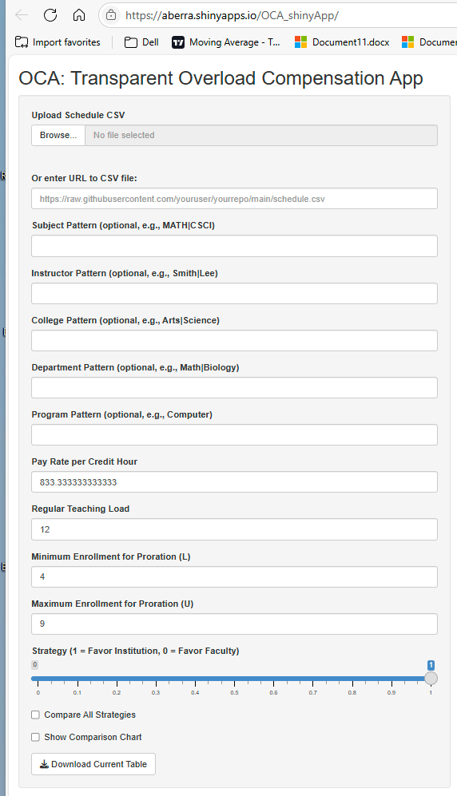
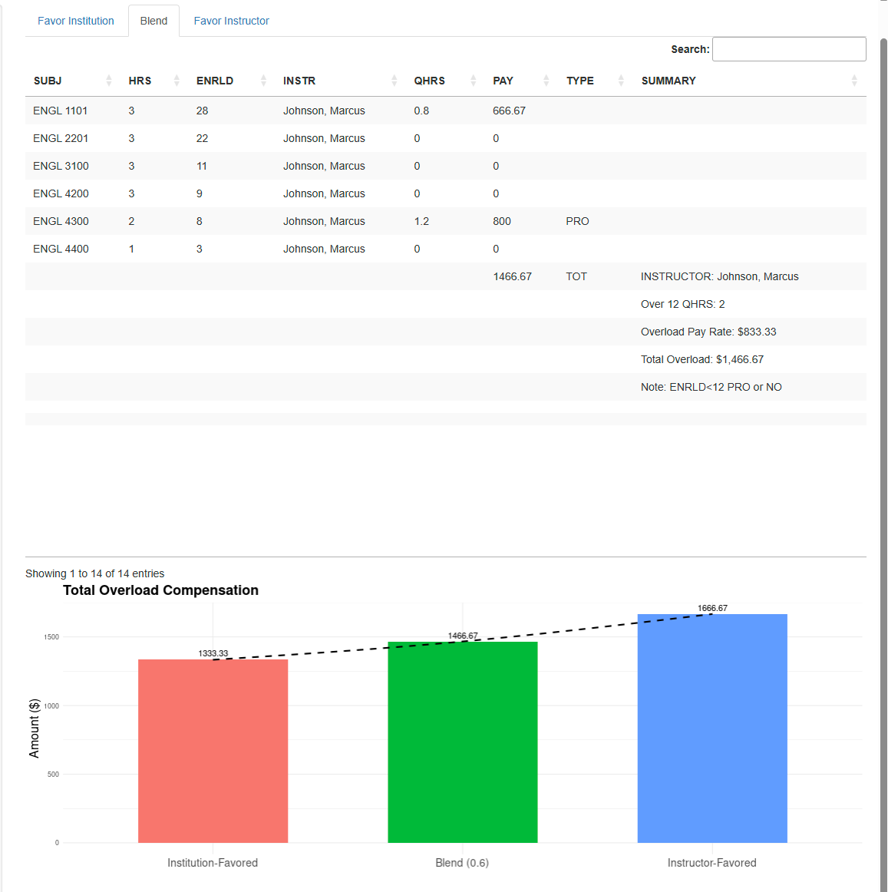

**OCA (Overload Compensation App)** is a Shiny web application designed to calculate fair instructor pay for overload teaching assignments in higher education. It applies institutional policy while offering strategic flexibility — allowing administrators to favor cost-saving, faculty retention, or a balanced approach.

# 🔑 Key Features

- Upload a teaching schedule in `.csv` format from:
  - a local data folder, or  
  - a URL pointing to such file  
- Optionally filter courses by:
  - Subject
  - Instructor
  - College
  - Department
  - Program  
- Specify institutional compensation policies:
  - Pay rate per qualified credit hour
  - Regular teaching load (in credit hours)
  - Minimum and maximum enrollment for proration  
    - For no proration, set both L and U to 1  
- Select a compensation strategy via slider:
  - **Favor Institution** – prioritizes cost savings
  - **Favor Faculty** – prioritizes fairness
  - **Blend** – weighted average between the two extremes  
- Option to compare all strategies in the output
- Visualize compensation differences with a comparison chart

# 🧪 How It Works

1. **Upload Input Data**  
   A `.csv` file with scheduled courses, instructor names, credit hours, and enrollments.

2. **Apply Filters (Optional)**  
   Filter down to specific departments, instructors, or programs for focused analysis.

3. **Set Institutional Policy Parameters**  
   Define standard teaching load, pay rate, and enrollment thresholds for proration.

4. **Select Strategy**  
   Use the slider to choose between institution-favored, instructor-favored, or blended strategy.

5. **View Output**  
   The app calculates and displays instructor-level pay by strategy, with comparison charts and summaries.

# 📸 Screenshot – UI for Left Panel

<br>



# 📸 Screenshot – Strategy Output Comparison
<br>



<br>


# 🖥️ Deployment

The OCA App is now live hosted at shinyapps.io:  
👉 [Launch OCA ](https://aberra.shinyapps.io/OCA_shinyApp/)

# 📁 Sample Data

Try the app using these example schedules:

- [`sample_schedule.csv`](https://raw.githubusercontent.com/dawit3000/OCA/main/sample_schedule.csv)  
- [`Johnson_n_Smith_schedule.csv`](https://raw.githubusercontent.com/dawit3000/OCA/main/Johnson_n_smith_schedule.csv)

# 🧰 Powered By

- [`catool`](https://github.com/dawit3000/catool) – R package for calculating overload pay based on institutional policy
- [`shiny`](https://shiny.posit.co/) – R package for building interactive web applications

# 📄 Related Articles

- **“catool: An R Package for Automating Fair Compensation in Higher Education”**  
  *(Submitted to The R Journal)*

- **“OCA: A Shiny Web Application for Transparent Overload Compensation in Higher Education”**  
  *(In preparation for submission to SoftwareX)*

# 💻 Run Locally


```{r, echo=TRUE, eval=FALSE}
# Install required packages
install.packages(c("shiny", "catool", "dplyr", "readr", "ggplot2", "DT", "shinyWidgets"))

# Run the app
library(shiny)
runApp("path/to/OCA_shinyApp")
---
  